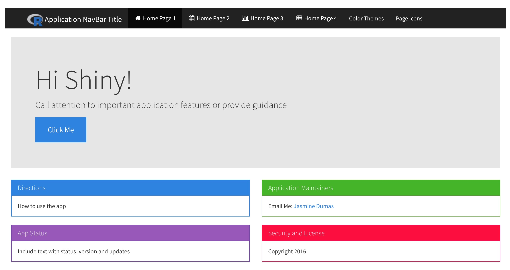

# shinyLP

### Bootstrap Landing Home Pages for Shiny

The goal of *shinyLP* is to provide functions that wrap HTML Bootstrap code to enable the design and layout of informative landing home pages for [Shiny](http://shiny.rstudio.com/) applications. A [Landing page](https://en.wikipedia.org/wiki/Landing_page) is the first page of a web app or website that a user interacts with to learn the purpose, usage and status of the tool. The user experience and interface are important features to consider when developing Shiny applications to direct, especially non-technical users how to use the application.

This package is inspired by the [shinyBS package](https://github.com/ebailey78/shinyBS) which incorporates useful components from the [Bootstrap web framework](http://getbootstrap.com/) for use in Shiny. *shinyLP* extends the Bootstrap components that are used in the Shiny package by making it easier by not having to write additional HTML code.

## Future package updates and ideas

* more examples on demo shiny app
* additional bootstrap components I'm interested in implementing:
    * [Media Objects](http://getbootstrap.com/components/#media-default)
    * [List Group](http://getbootstrap.com/components/#list-group)
    * [Badges](http://getbootstrap.com/components/#list-group-badges)
    * [Wells](http://getbootstrap.com/components/#wells)

## shinyLP Example

This example features a informative layout calling attention to key features, directions package status, security or licensing, package maintainer contact.

* To run this example provided from the package:
```r
shinyLP::runExample()
```




## How to install this package?

To install the package type the following:

```r
install.packages("shinyLP")
library("shinyLP")
```

Or you can install the development version from Github:

```r
library(devtools)
install_github("jasdumas/shinyLP")
library(shinyLP)
```

## How to use this package?

The components of the package are functions that wrap HTML Bootstrap code for use in shiny apps. Include the functions in the UI section of your app to provide additional features which normally requires including HTML code.

This project is released with a [Contributor Code of Conduct](https://github.com/jasdumas/shinyLP/blob/master/CONDUCT.md). By participating in this project you agree to abide by its terms.

## Contact

Package Author: Jasmine Dumas [@jasdumas](https://twitter.com/jasdumas) | [jasdumas.github.io](http://jasdumas.github.io/) 
